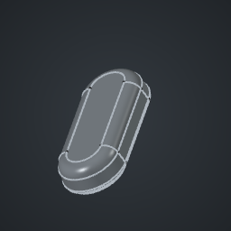

# TestProject

<!-- GITPDM:PART-GLOSSARY:START -->
## Part Glossary

_Auto-generated by GitPDM from exported previews. Do not edit this section by hand; it is regenerated on export._

| Preview | Name | Path | Category | Bounding Box (mm) |
|---|---|---|---|---|
|  | [GoodShape](previews/GoodShape.stl) | `cad/GoodShape.FCStd` | part | 2e+100 x 2e+100 x 2e+100 |
<!-- GITPDM:PART-GLOSSARY:END -->
